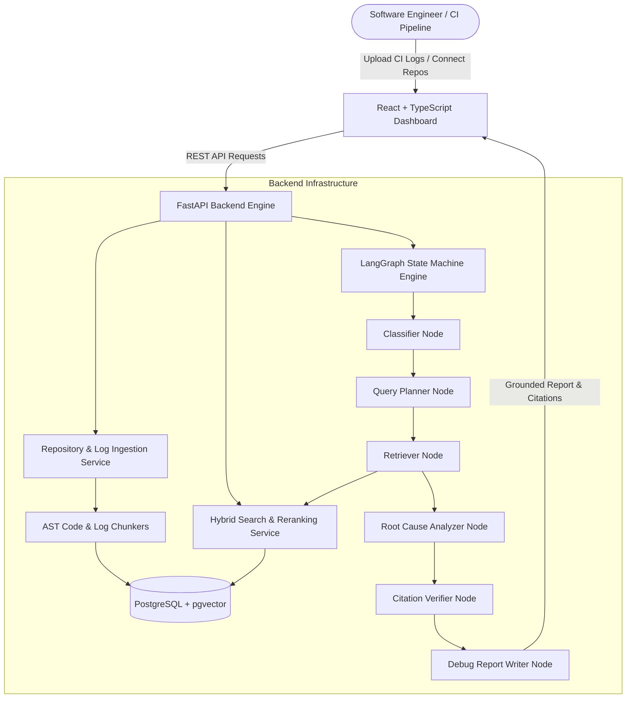

# 🧠 DebugMind

> **Autonomous AI Reliability Engineer for Software Teams**

DebugMind is a production-grade AI reliability platform that analyzes failed CI logs, inspects codebase repositories, executes multi-step **LangGraph agent workflows**, and generates grounded **Retrieval-Augmented Generation (RAG) debugging reports** with strict evidence citations.

---

## 🌟 Key Features

- **📂 Multi-Source Repository Ingestion**:
  - Connect and clone public/private **GitHub Repositories** directly (`git clone --depth 1`) or scan local workspace folder paths.
  - Automatically parses source code files into language-specific AST symbols.

- **✂️ Language-Aware AST Code Chunkers**:
  - **Python Chunker**: Splits classes, functions, and top-level definitions.
  - **JS/TS Chunker**: Parses ES6 modules, React components, and TypeScript interfaces.
  - **Markdown & Log Chunkers**: Extracts structured sections, pytest failure blocks, and stack traces.

- **🔍 Hybrid Vector Search & Relevance Reranker**:
  - **Dense Vector Search**: Powered by PostgreSQL `pgvector` cosine similarity embeddings.
  - **Sparse Keyword Search**: BM25-style term frequency matching.
  - **Relevance Reranking**: Normalized score fusion to order evidence by exact context match.

- **🤖 LangGraph Agent State Machine Workflow**:
  - Multi-step bounded state machine pipeline:
    `Classification Node` ➔ `Query Planner Node` ➔ `Retriever Node` ➔ `Root Cause Analyzer Node` ➔ `Citation Verifier Node` ➔ `Report Writer Node`.
  - Automatic retry loops when evidence is weak or ungrounded.

- **📑 Grounded RAG Debug Reports**:
  - Produces structured JSON debug reports with executive summary, root cause hypothesis, suggested code fix, confidence score, and line-range evidence citations.

- **🎨 Linear/Vercel Developer Dashboard**:
  - React + TypeScript + Vite + Tailwind CSS dashboard with dark/light mode.
  - Interactive **AST Code Viewer**, **CI Log Viewer**, **Evidence Citations**, and **LangGraph Step Telemetry Timeline**.

---

## 🏗️ Architecture Overview



---

## 📁 Repository Structure

```text
debugmind/
├── backend/
│   ├── app/
│   │   ├── agents/            # LangGraph state machine workflow nodes
│   │   ├── api/routes/        # FastAPI REST endpoints (projects, repos, logs, search, reports, agent-runs)
│   │   ├── core/              # Environment config and database settings
│   │   ├── db/                # SQLAlchemy session setup
│   │   ├── models/            # SQLAlchemy database models (pgvector extensions)
│   │   ├── schemas/           # Pydantic validation schemas
│   │   └── services/          # Ingestion, AST chunkers, embeddings, hybrid search, reranker, RAG generator
│   ├── tests/                 # 27/27 passing Pytest test suite
│   ├── pyproject.toml
│   └── Dockerfile
├── frontend/
│   ├── src/
│   │   ├── components/        # AppShell, Sidebar, Topbar, CodeViewer, LogViewer, EvidenceCard, AgentTimeline
│   │   ├── features/          # Projects, Repositories, CI Logs, Analysis, Debug Reports, Agent Trace
│   │   ├── lib/               # TanStack Query API client & formatters
│   │   ├── routes/            # React Router page navigation
│   │   └── types/             # TypeScript interface schemas
│   ├── package.json
│   └── vite.config.ts
├── docker-compose.yml
└── README.md
```

---

## 🚀 Quickstart & Local Setup

### Prerequisites

- **Python**: 3.9+
- **Node.js**: 18+
- **PostgreSQL**: 17 (with `pgvector` extension enabled)

---

### 1. Backend Setup

```bash
cd backend

# Create virtual environment
python3 -m venv venv
source venv/bin/activate

# Install dependencies
pip install -r requirements.txt

# Run database migrations (or auto-create tables)
python3 -c "from app.db.session import init_db; init_db()"

# Launch FastAPI development server
uvicorn app.main:app --host 0.0.0.0 --port 8000
```

Backend server runs at: `http://localhost:8000`  
Interactive Swagger API docs at: `http://localhost:8000/docs`

---

### 2. Frontend Setup

```bash
cd frontend

# Install dependencies
npm install

# Start Vite development server
npm run dev -- --port 5173
```

Frontend dashboard runs at: `http://localhost:5173`

---

### 3. Docker Compose Setup (Containerized)

```bash
docker-compose up --build
```

---

## 🧪 Testing & Verification

### Run Backend Unit Tests

```bash
cd backend
pytest -v
```
> **Result**: `27 passed` across all modules (ingestion, AST chunking, embeddings, hybrid search, RAG generator, LangGraph workflow).

### Run Frontend Typecheck & Production Build

```bash
cd frontend
npm run lint    # Runs tsc --noEmit
npm run build   # Compiles Vite production bundle
```

---

## 📡 API Reference Summary

| Method | Endpoint | Description |
| :--- | :--- | :--- |
| `GET` / `POST` | `/projects` | List or create workspace projects |
| `POST` | `/projects/{id}/repositories` | Connect GitHub repo or local folder |
| `POST` | `/repositories/{id}/ingest` | Scan and ingest source code files |
| `POST` | `/repositories/{id}/chunk` | Run language-aware AST symbol chunking |
| `POST` | `/projects/{id}/embeddings/index` | Build vector embeddings in PostgreSQL `pgvector` |
| `POST` | `/projects/{id}/logs` | Upload raw CI build or test logs |
| `POST` | `/logs/{id}/parse` | Extract pytest failure events and stack traces |
| `POST` | `/search/hybrid` | Execute hybrid vector + keyword semantic search |
| `POST` | `/debug-reports` | Generate grounded RAG debugging report |
| `POST` | `/agent-runs` | Execute LangGraph multi-step debugging state machine |

---

## 📜 License

Distributed under the MIT License. Developed for software teams building reliable software.
