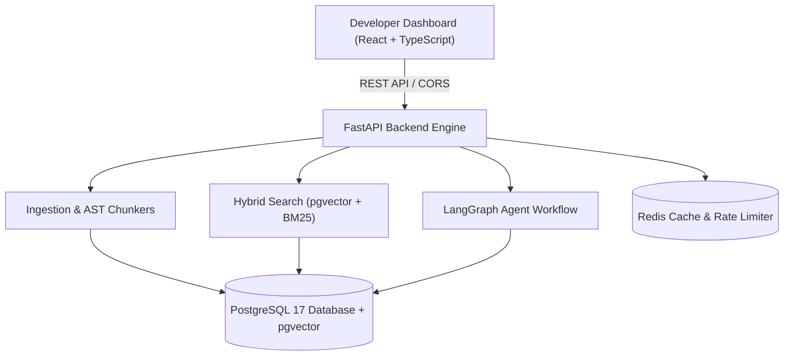
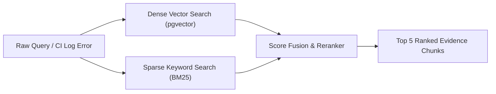
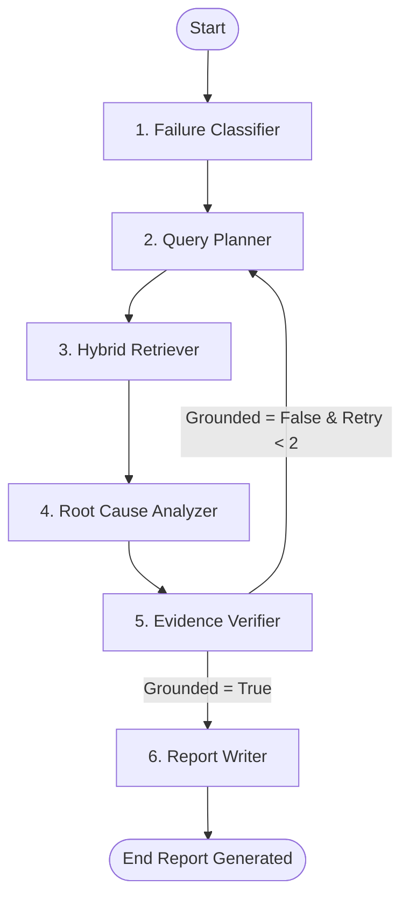

# DebugMind: Agentic AI Reliability Engineer

[](https://github.com/202512105-priya/debugmind/actions)
[](https://www.python.org/downloads/)
[](https://fastapi.tiangolo.com/)
[](https://react.dev/)
[](https://render.com)

> **DebugMind** is a production-style, autonomous AI reliability engineering platform that ingests source code repositories and failed CI build/test logs, performs hybrid vector + BM25 search, executes bounded multi-step **LangGraph agent workflows**, and generates grounded debug reports with line-range evidence citations.

---

## 🚀 Live Demo & Deployments

- **Frontend Dashboard**: [https://debugmind-dashboard.onrender.com](https://debugmind-dashboard.onrender.com)
- **Backend API**: [https://debugmind-api.onrender.com](https://debugmind-api.onrender.com)
- **Interactive Swagger Docs**: [https://debugmind-api.onrender.com/docs](https://debugmind-api.onrender.com/docs)

---

## 💡 The Problem & Solution

### The Problem
Software teams spend up to **30% of engineering time** sifting through complex CI failure logs, stack traces, and large codebases to diagnose why a test failed or why a service refused connection.

### The Solution
DebugMind automatically parses stack traces, isolates relevant code files using structure-aware AST chunking, retrieves evidence using **PostgreSQL `pgvector` hybrid search**, executes a 6-node **LangGraph state machine**, verifies hypothesis grounding, and produces an actionable root-cause analysis report.

---

## 📐 System Architecture Diagrams

### 1. High-Level System Architecture


---

### 2. Multi-Stage Hybrid RAG Search Pipeline


---

### 3. LangGraph Agent State Machine Workflow


---

## 📈 Evaluation Benchmark Results

Evaluated across the `DebugMind Golden Baseline v1.0` dataset containing 5 synthetic failure scenarios (`payments-api`):

| Metric | Score / Rate | Benchmark Target | Status |
| :--- | :--- | :--- | :--- |
| **Cases Evaluated** | `5` | 5+ cases | ✅ Passed |
| **Retrieval Recall@5** | `100.0%` | $\ge 80\%$ | ✅ Passed |
| **Retrieval Precision@5** | `100.0%` | $\ge 50\%$ | ✅ Passed |
| **Root Cause Correctness** | `5.00 / 5.0` | $\ge 4.0 / 5.0$ | ✅ Passed |
| **Evidence Groundedness** | `4.50 / 5.0` | $\ge 4.0 / 5.0$ | ✅ Passed |
| **Suggested Fix Relevance** | `4.73 / 5.0` | $\ge 4.0 / 5.0$ | ✅ Passed |
| **Hallucination Risk Score** | `1.00 / 5.0` | $\le 1.5 / 5.0$ | ✅ Passed |
| **Format Validity Rate** | `100.0%` | $100\%$ | ✅ Passed |
| **Average Latency per Case** | `4.7 ms` | $< 2000\text{ ms}$ | ✅ Passed |
| **Average Cost per Case** | `$0.0080` | $< \$0.02$ | ✅ Passed |

---

## 🛠️ Tech Stack & Architecture

- **Backend Engine**: Python 3.9, FastAPI, Uvicorn, Pydantic v2, SQLAlchemy, Alembic.
- **AI & Agent Workflow**: LangGraph, LangChain, OpenAI (`gpt-4o-mini`, `text-embedding-3-small`).
- **Database & Search Engine**: PostgreSQL 17, `pgvector` extension, BM25 term frequency matching.
- **Cache & Security**: Redis (In-memory fallback), regex secret redactor, sliding-window rate limiter.
- **Frontend Dashboard**: React 18, TypeScript, Vite, Tailwind CSS, Lucide Icons.
- **Deployment & Infrastructure**: Render (Web Service + Static Site + PostgreSQL + Redis), Docker, GitHub Actions CI.

---

## 💻 Local Quickstart Guide

### Prerequisites
- Python 3.9+
- Node.js 18+
- PostgreSQL 17 with `pgvector`

### 1. Backend Setup
```bash
cd backend
python3 -m venv venv
source venv/bin/activate
pip install -r requirements.txt
uvicorn app.main:app --host 0.0.0.0 --port 8000 --reload
```

### 2. Frontend Setup
```bash
cd frontend
npm install
npm run dev
```

### 3. Run Benchmark Evaluations
```bash
python3 evals/scripts/run_eval.py
```

---

## 📂 Documentation Directory (`docs/`)

- [`docs/architecture.md`](docs/architecture.md): Deep-dive into AST chunking and search fusion algorithms.
- [`docs/api.md`](docs/api.md): Full REST API endpoint reference.
- [`docs/eval-report.md`](docs/eval-report.md): Detailed evaluation harness breakdown.
- [`docs/deployment.md`](docs/deployment.md): Step-by-step Render deployment guide.
- [`docs/interview-cheat-sheet.md`](docs/interview-cheat-sheet.md): Placement interview Q&A guide.

---

## 📄 License
MIT License. Created by [Priya Shah](https://github.com/202512105-priya).
